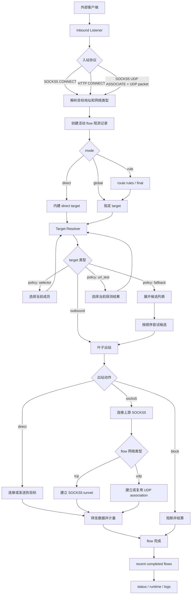

# 请求生命周期

这份文档描述请求从外部进入 Zero 代理运行时，到完成出站转发和观测结算的实际流转。

这里的“生命周期”指内核处理链路。

## 总览

一条请求在 Zero 里的主路径是：

1. 入站监听接收外部连接或 UDP associate 控制连接
2. 协议层解析请求，生成内部流量对象
3. `zero-engine` 准备观测记录
4. 路由根据 `mode` 和 `route` 决定目标
5. 目标解析把路由目标展开成具体出站或候选出站
6. 出站建立连接或处理阻断
7. 转发数据并持续计量
8. 请求结束后完成观测结算

当前 TCP 和 SOCKS5 UDP 使用同一套观测字段，但生命周期边界不同：

- TCP 按连接建模
- SOCKS5 UDP 按目标 flow 建模

## 入口

入站监听由 `zero-proxy` 启动。

当前支持：

- `socks5`
- `http_connect`
- `mixed`

入站只负责接收外部请求和完成协议握手，不负责出站选择。

`mixed` 入站会先读取首字节判断协议，再转交给对应协议处理路径。

## 协议解析

协议层把外部协议请求解析成内部流量对象。

当前内部实现名是 `Session`，但它是内核实现细节，不作为长期对外 API 概念。

对外控制面更合适的长期概念是 `flow`：

- TCP connection 是一个 flow
- SOCKS5 UDP 到同一目标的报文序列是一个 flow

内部流量对象至少包含：

- 目标地址
- 目标端口
- 网络类型：`tcp` / `udp`
- 协议来源：`socks5` / `http_connect`
- 入站 tag

## 观测准备

内核在完成协议解析后创建活动观测记录。

活动记录负责累计：

- `bytes_up`
- `bytes_down`
- `inbound_rx_bytes`
- `inbound_tx_bytes`
- `outbound_rx_bytes`
- `outbound_tx_bytes`
- 1 秒采样吞吐

TCP 在连接建立后持续计量。

SOCKS5 UDP 在首个目标报文到达时创建 flow，控制连接关闭时结算仍然活跃的 flow。

## 路由决策

路由决策由 `mode` 决定：

- `direct`：跳过规则，直接走内建直连目标
- `global`：所有请求走指定 target
- `rule`：按规则匹配，未命中走 `final`

规则匹配当前支持：

- 域名
- CIDR
- 本地文件 rule set
- `and`
- `or`

路由输出不应该长期称为 `outbound`。更准确的对外概念是 `target`。

`target` 可以指向：

- 具体出站
- 策略

## 目标解析

内核会把路由得到的 target 解析成可执行目标。

当前内部通过 `EnginePlan` 把 tag 引用编译成 `TargetId` 图。

长期对外命名建议：

- `outbounds`：具体出站能力，例如 `direct`、`block`、`socks5`
- `policies`：选择或组合策略，例如 `selector`、`fallback`、`url_test`
- `target`：路由和模式引用的统一目标

配置里的 `outbound_groups` 是配置模型字段；对外控制面使用 `policy` / `policies` 表达同类运行时能力。

## 出站处理

目标解析后会得到：

- 单个叶子出站
- fallback 候选列表

叶子出站当前包括：

- `direct`
- `block`
- 上游 `socks5`

TCP：

- `direct`：直接连接目标地址
- `block`：向客户端返回阻断
- `socks5`：连接上游 SOCKS5 并建立 tunnel

SOCKS5 UDP：

- `direct`：通过本地 UDP socket 发往目标
- `block`：直接结算为阻断
- `socks5`：建立或复用上游 SOCKS5 UDP association

`fallback` 会按候选顺序尝试，某个候选成功后本次 flow 固定使用该候选。

## 数据转发

计量口径是应用层链路字节，不是纯 payload。
当前会计入：

- 入站协议握手读写，例如 SOCKS5 greeting、SOCKS5 request、HTTP CONNECT request/response
- 出站协议握手读写，例如上游 SOCKS5 CONNECT / UDP ASSOCIATE
- SOCKS5 UDP 封包头
- 实际转发 payload

当前不会计入：

- TCP/IP 包头
- TCP 三次握手和四次挥手
- 操作系统网络栈或网卡层额外开销

TCP 使用双向转发：

- 客户端到出站记为上行链路字节
- 出站到客户端记为下行链路字节

SOCKS5 UDP 使用报文转发：

- 客户端 SOCKS5 UDP 报文到目标记为上行链路字节
- 目标响应封装后回客户端记为下行链路字节

## 完成结算

flow 结束时，活动记录转为最近完成记录。

完成记录保留：

- flow 基本信息
- 入站和出站 tag
- 模式
- 网络和协议
- 开始、最后活动和结束时间
- 累计字节
- outcome

当前 outcome 包括：

- `direct-relayed`
- `chained-relayed`
- `blocked`
- `failed`

完成记录当前只保留最近固定容量历史。

## 失败路径

失败可能发生在：

- 协议解析
- 路由决策
- target 解析
- 出站连接
- 上游 SOCKS5 握手
- 数据转发
- UDP 上游 association

已经创建 flow 的失败会进入完成记录，并记录为 `failed`。

协议解析阶段尚未形成内部 flow 的失败，只进入连接错误日志，不进入 flow 观测。

## 控制面边界

当前控制面通过 `/api/v1/*`、IPC 和 CLI 导出同一组核心能力。

长期 API 应基于 Zero 自己的核心概念：

- `flows`
- `outbounds`
- `policies`
- `targets`
- `routes`
- `stats`
- `events`

不要把内部实现名 `Session` 固化成正式控制面概念；外部观测使用 `flow` / `flows`。
